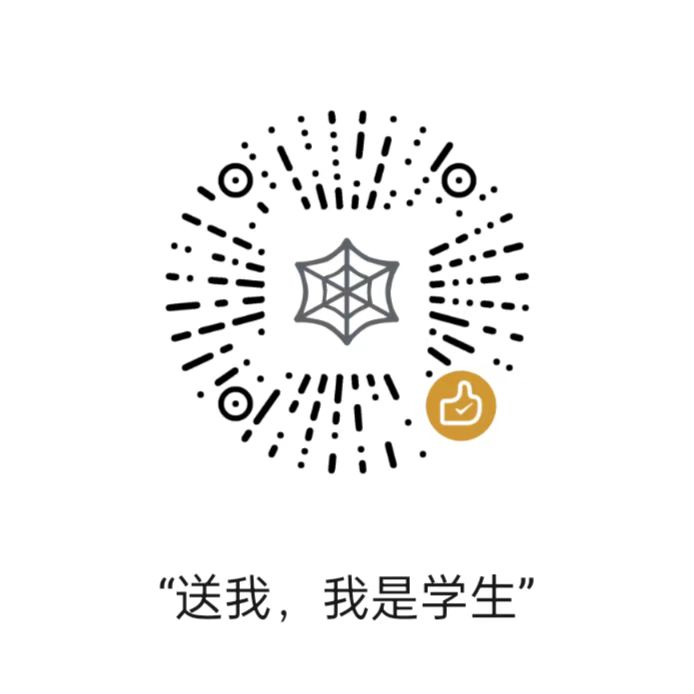

# 我是学生

> 我是一名程序员，不抽烟，酒也浅尝即止。
>
> 工作认真，事情也都处理得很好。不执着于胜负，不纠结于烦恼。
>
> 每天最晚 10 点之前都会回家，晚上 11 点上床睡觉，保证睡满 8 个小时。
>
> 睡前会喝一杯热牛奶，做 20 分钟伸展操，让身体放松下来才上床，这样就能一觉睡到天亮。
>
> 早上醒来就像婴儿一样，不残留半点疲劳和压力。
>
> 连医生都说我很健康。

