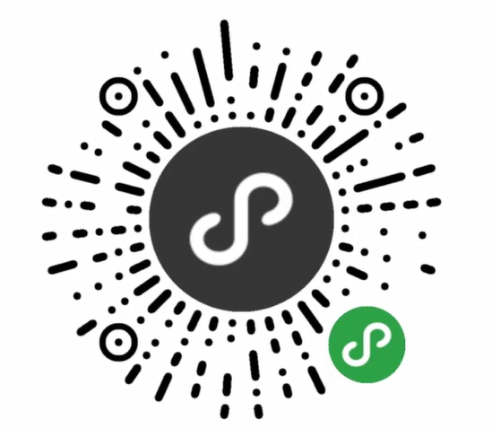
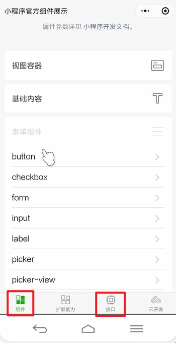
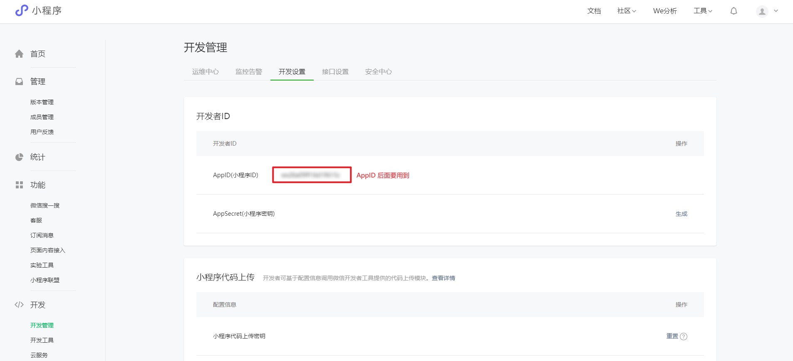

# 小程序简介

## 1. 小程序与普通网页开发的区别

- 小程序于普通网页主要有 3 大区别：
  - 1. 运行环境不同
    - **网页** 运行在 **浏览器环境** 中
    - **小程序** 运行在 **微信环境** 中
  - 2. API 不同
    - 不能使用浏览器的 DOM、BOM 等接口，而是使用微信提供的独有 API 接口
    - 例如：地理位置、扫码、支付等等
  - 3. 开发模式不同
    - 网页的开发模式：浏览器 + 代码编辑器 即可进行开发
    - 小程序开发分 3 步：申请小程序开发账号、安装小程序开发者工具、创建和配置小程序项目

## 2. 体验小程序

- 微信扫码体验小程序：

  

- 以下展示了小程序的基本功能，常用的内容是：组件 和 接口

  

## 3. 申请小程序开发账号

打开连接 <tgx-link href="https://mp.weixin.qq.com/">https://mp.weixin.qq.com/</tgx-link> 申请一个小程序个人开发账号，并登录，可看到如下页面：

## 4. 安装小程序开发工具

> 不建议使用 VS Code 来开发小程序，而是使用微信官方提供的小程序开发工具。

打开连接 <tgx-link href="https://developers.weixin.qq.com/miniprogram/dev/devtools/stable.html">https://developers.weixin.qq.com/miniprogram/dev/devtools/stable.html</tgx-link>
下载对应系统的 Stable Build 工具并安装。

## 5. 熟悉开发者工具 5 个部分

- 菜单栏。提供所有功能的设置
- 工具栏。提供编译、控制界面显隐等功能
- 模拟器。可以展示开发时的页面
- 代码编辑区。编辑小程序代码
- 调试区。用于开发调试
