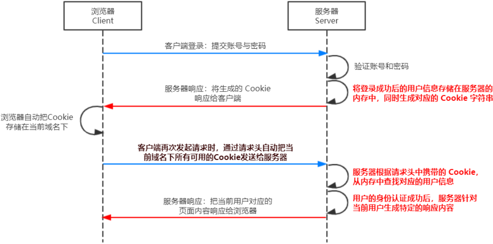
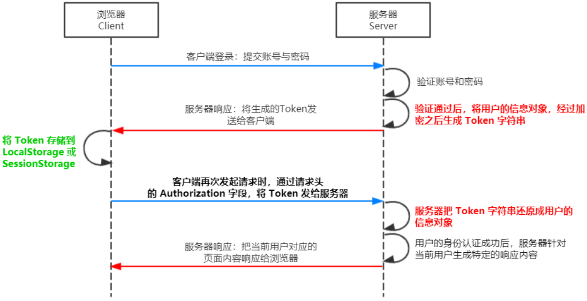

# 网站的 身份认证

::: tip 栏目说明
本栏目收集了一些有关 身份认证（Authentication）的内容。
:::

## 1. 什么是 身份认证？

::: tip 概要

- **身份认证** 又称 “**身份验证**”、“**鉴权**”，是指 **通过一定的手段，完成对用户身份的确认**。
- 身份认证不止一种方案，根据 web 开发的模式，可以选择不同认证方案
  - **服务端渲染** 推荐使用 **Session 认证机制**
  - **前后端分离** 推荐使用 **JWT 认证机制**

:::

## 2. Session 认证机制

::: tip 前置条件

- **http 协议无状态性** 指的是客户端的每次 HTTP 请求都是独立的，连续多个请求之间没有直接的关系，服务器不会主动保留每次 HTTP 请求的状态。

- **Cookie** 是存储在用户浏览器中的一段 **不超过 4 KB 的字符串**。它由一个名称（Name）、一个值（Value）和其它几个用于控制 Cookie 有效期、安全性、使用范围的可选属性组成。Cookie 具有以下特性：
  - 自动发送
  - 域名独立
  - 过期时限
  - 4KB 限制

:::

- Session 认证机制 的实质就是 Cookie + SessionId 双向认证
  - 1. 第一次登录后，服务端验证 帐号 和 密码 成功
  - 2. 会给当前用户**生成一个 SessionId 存在服务端**，**同时生成一串 cookie 返回给客户端**
  - 3. 同时生成的 SessionId 和 cookie 有着对应关系，不同用户有着不同的 SessionId 和 cookie
  - 4. 随后客户端存储 cookie **（ Cookie 不能含用户信息 ）**
  - 5. 后续每个客户端发送请求都会携带自己的 cookie
  - 6. 当服务端接收到请求后，首先拿着 cookie 信息找到对应的 SessionId，再返回对应的用户信息
  - 7. 只要处于登录状态，且 cookie 和 SessionId 配对成功，说明身份认证成功了

要在 express 项目中使用 Session 认证机制，请查看
<tgx-link href="/backend/packages/third-party-packages">这篇文章</tgx-link>
的 【express-session 中间件】 用法

## 3. JWT 认证机制

::: tip 说明

JWT（即 JSON Web Token）是目前最流行的 **跨域认证解决方案**。

:::

- Session 认证机制 的局限性

  - Session 认证机制需要配合 Cookie 才能实现。
  - 由于 Cookie 默认不支持跨域访问，所以，当涉及到前端跨域请求后端接口的时候，需要做很多额外的配置，才能实现跨域 Session 认证。

- 认证机制选型
  - 当前端请求后端接口 **不存在跨域问题** 的时候，推荐使用 Session 身份认证机制。
  - 当前端需要 **跨域请求** 后端接口的时候，推荐使用 JWT 认证机制。

### 1. JWT 认证原理

::: tip 原理

用户的信息通过 Token 字符串的形式，保存在客户端浏览器中。服务器通过还原 Token 字符串的形式来认证用户的身份。

:::

- 具体实现步骤：
  - 1. 浏览器使用 帐号、密码 登录
  - 2. 服务器确认帐号密码后，将 **用户信息对象** 加密成 Token 字符串
  - 3. 返回 加密后的 Token 字符串给客户端存储 **（用户信息存在客户端）**
  - 4. 后续客户端发送请求都会携带这个 请求头 Token 字符串
  - 5. 服务器就会拿到 这个 Token 字符串 进行解密，还原成 用户信息对象
  - 6. 解密验证成功后，才返回对应的响应内容

### 2. JWT 的 3 个组成部分

::: tip 说明

- JWT 一般由 Header（头部）、Payload（有效荷载）、Signature（签名）组成
- 具体组成格式：Header.Payload.Signature
  - 例如： xxxxx.yyyyyy.zzzzzz

:::

- Payload 部分才是真正的用户信息，它是用户信息经过加密之后生成的字符串。
- Header 和 Signature 是安全性相关的部分，只是为了保证 Token 的安全性。

要在 express 项目中使用 JWT 认证机制，请查看
<tgx-link href="/backend/packages/third-party-packages">这篇文章</tgx-link>
的 【jsonwebtoken 和 express-jwt】 用法
