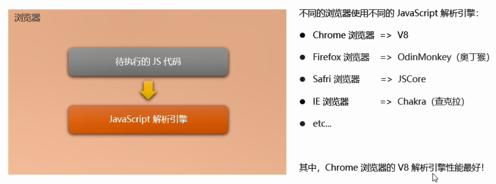
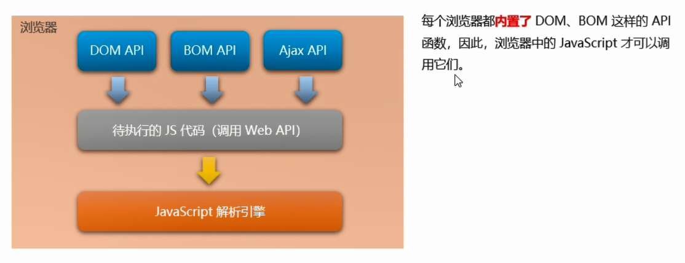
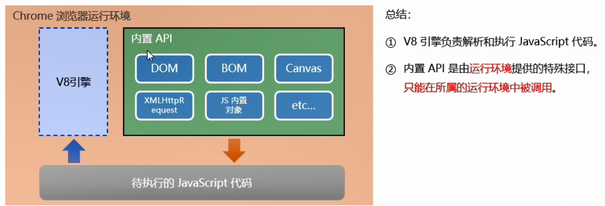

# 浏览器 相关知识

::: tip 栏目说明

本栏目收录了一些 浏览器 的相关知识

:::

## 1. 浏览器为什么能运行 JavaScript ?

::: tip 说明

浏览器是 JS 的 **宿主环境** 之一。浏览器能运行 JS 代码，是因为它内置了 **JavaScript 解析引擎**。

:::

- js 代码在浏览器被加载之后，本质上只是一些字符串。浏览器利用了 **JavaScript 解析引擎** 来解析这些字符串，从而实现运行 js 代码的功能
- 每个浏览器都有自己的 JavaScript 解析引擎 ，目前，**性能最好的解析引擎是 V8**

## 2. JS 为什么能操作 DOM 和 BOM ?

::: tip 说明

因为浏览器内置了一些操作 DOM、 BOM 和 Ajax 的 api 接口，所以我们就可以基于这些 api 编写一些 **操作 DOM、BOM、Ajax 的 js 代码**。浏览器拿到这些代码后，就交给 js 解析引擎处理，从而实现 js 代码操作 DOM，BOM 和 Ajax 的功能。

:::

## 3. 浏览器中的 JS 运行环境

::: tip 说明

- 运行环境：是指代码正常运行所需的必要环境
- 就像种子发芽的必要环境是：适宜的温度、氧气、水一样，js 代码运行也需要特定的环境

:::

- 对于 Chrome 浏览器来说，js 代码运行的两个条件：
  - V8 解析引擎
  - 内置 API

## 4. 浏览器的调试工具

::: tip 目录

1. 端点调试

:::

### 1. 端点调试

- 单步跳过 F10：会让代码从上往下，逐行执行，**遇到函数调用，也直接跳到下一个语句**
- 单步调试 F11：会让代码从上往下，逐行执行，**遇到函数调用，会进入函数体内部**
- 单步跳出 shift + F11：会跳出当前函数（函数执行完成），接着执行函数调用以后的代码
