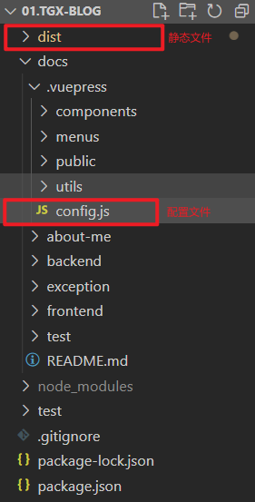

# 使用 vuepress 搭建个人博客

::: tip 起因

以前做笔记都是写在书本上，但随着新技术的探索，知识点不断增多，本子上根本写不下。
且笔记本太厚不好携带。因此有了搭建博客的想法。

:::

## 1.技术选型

::: tip 选型依据
相比 Jekyll、Hugo、Hexo，我选择了 vuepress。如果你也具有以下需求，可以考虑使用它。
:::

- 想要快速上手。在短时间内完成博客搭建
- 注重内容。专注于文档内容，而非花哨的页面
- 多端适配。开发部署后，不管是手机、平板、还是 PC 端都可以随时查看

## 2.开始搭建

### 1.新建项目文件夹

::: tip 说明
也可以用鼠标手动新建一个文件夹，在这个文件夹内打开终端，
在这里，我直接用了终端命令新建文件夹，并切到该文件夹目录下
:::

```xml
mkdir vuepress-blog
cd vuepress-blog
```

### 2.初始化包管理

::: tip 说明
也可以用其他的包管理器，比如 yarn。在这里，我用了 npm 并使用它默认配置
:::

```xml
npm init -y
```

### 3.安装 vuepress

::: tip 说明
vuepress 局部安装就好，在这里我用了 cnpm 来安装，你可以直接使用 npm 安装。
:::

```xml
cnpm install -D vuepress


<!-- 此时 package.json 会多出这个(日后可能版本会变更，这里以 1.9.7 为例) -->
{
  "devDependencies": {
    "vuepress": "^1.9.7"
  }
}
```

### 4.添加脚本

::: tip 说明
在 package.json 的 scripts 下添加`dev`和`build`命令。

:::

```xml
{
  "scripts": {
    "dev": "vuepress dev docs",
    "build": "vuepress build docs"
  }
}


<!-- 推荐手动搭建项目结构，如果你照着官网来创建首页 README.md，有可能跑起来是乱码 -->
<!-- 完成后，你应该保证项目大概长这样，请自建文件夹 -->
vuepress-blog           (项目根文件夹)
├── docs                (文档存放地)
│ ├── .vuepress         (配置目录)
│ │ ├── components      (自动注册的vue组件)
│ │ ├── public          (静态图片)
│ │ └── config.js       (vuepress配置)
│ │
│ └── README.md         (首页定制地)
|
├── package.json        (包相关)
└── package-lock.json   (包相关)
```

### 5.终端跑起来，浏览器访问

::: tip 说明
VuePress 会在 http://localhost:8080 启动一个热重载的开发服务器。打开浏览器访问即可
:::

```xml
<!-- 使用以下命令启动项目 -->
npm run dev
```

### 6.定制博客内容

::: tip 说明
百度搜索并打开 vuepress 中文文档，找到 `指南` 查看详细文档。要想定制 `.vuepress/config.js` 内容，
就要找到 `默认主题配置` 对应的文档。在这里，我就不当复读机了，但请你一定要搞明白`config.js`里面的`图片路径`和`文件路径匹配机制`。

值得一提的是，当你修改`vuepress的默认配置文件`后，需要重新`npm run dev`启动一下项目，才能生效。
因为我们的开发服务器是基于配置文件运行的，如果不重启项目，它依然使用上一次的配置文件，而不会发生更新。
:::

- 可以参考一下我的部分配置。

::: details 点击查看代码

```js
// 1.9.7版本的配置（日后可能会变动）
module.exports = {
  // 部署站点的基准路径, 默认是 /
  base: '/tgx-blog/',

  // 左上角的标题
  title: 'telectron 的博客',

  // 网站的 SEO 描述
  description: '一个普通上班族的博客',

  // 需要被注入到 <head> 标签的内容
  head: [
    [
      // 添加一个 link 标签到 <head> 中
      'link',
      // link 标签具有以下属性
      {
        rel: 'shortcut icon',
        // 路径指向 .vuepress/public
        href: '/xiao.ico'
      }
    ]
  ],

  // 指定 build 的输出目录, 默认打包到 docs/.vuepress/dist 下
  dest: './dist', // 现在会打包到与 docs 平级的目录下
  // markdown 相关配置
  markdown: {
    // 给 .md 文件中每个代码块显示行号
    lineNumbers: true
  },

  // 插件
  // plugins: ['@vuepress/last-updated'],

  // vuepress 默认主题 的配置
  themeConfig: {
    // 左上角网站 Logo
    logo: '/img/logo.png',
    // 顶部导航栏
    nav: [
      {
        text: '前端学习',
        items: [
          // 1️. 如果 link 为 '/test/', vuepress 会去 docs/test 文件夹中查找 README.md
          // 2. 如果 link 为 '/test/README', 会出错404(即使有 README.md 文件)
          // 3. 如果 link 为 '/test/README.md', 会出错404(即使有 README.md 文件)
          // 4. 如果 link 为 '/test/test-001', vuepress 会去 docs/test 文件夹中查找 test-001.md
          // 5. 如果 link 为 '/test/test-001.md', vuepress 会去 docs/test 文件夹中查找 test-001.md
          // { text: 'test', link: '/test/test-001' },
          // 为了可读性, 我们将采取 方案4 来管理文章链接
          { text: 'vue2', link: '/frontend/vue2/personal-blog' }
          // { text: 'vue3', link: '/frontend/vue3/' }
        ]
      }
    ],
    // 侧边栏菜单(将来文章多了，可能会考虑把 nav 和 sidebar 抽成一个.js单独维护，你现在就可以这么做)
    sidebar: [
      {
        // 设置一级标题(子标题会从.md文档中自动提取)
        title: '使用 vuepress 搭建个人博客',
        // 对应的文章路径(nav 里面的 link 就跳到这里, 采取方案4)
        path: '/frontend/vue2/personal-blog'
      },
      {
        title: '资源整合',
        path: '/frontend/vue2/bk-open-source'
      },
      {
        title: 'Git 命令收集',
        path: '/frontend/vue2/git-command'
      }
    ],
    // 标题深度，2 表示提取 h2 和 h3 标题
    sidebarDepth: 2,

    // 是否启用页面滚动效果
    smoothScroll: true,

    // 最后更新时间
    lastUpdated: '最后更新时间',

    // 是否开启页面底部的 下一篇 链接
    nextLinks: true,
    // 是否开启页面底部的 上一篇 链接
    prevLinks: true,

    // 仓库链接文字
    repoLabel: 'Gitee 仓库',
    // 仓库地址
    repo: 'https://gitee.com/tgx-1587900660/tgx-blog'
  }
}
```

:::

## 3.发布部署 (这里有坑)

### 1. 正常流程

::: tip 说明
码云 Gitee 提供了一个 Git pages 服务，可以把静态页面直接部署在 Gitee 上。以实现让所有人访问，且不需要你自己购买服务器。

假设我的项目仓库地址是 **https://gitee.com/tgx-1587900660/tgx-blog**

那么使用了 Git pages 服务后，就会自动生成一个在线地址，

形如：**https://tgx-1587900660.gitee.io/tgx-blog** 就可以让所有人访问了
:::

- 第一步：本地项目与云端仓库建立链接

  - 首先，我们的项目在本地搭建好，要使用 Gitee 服务，就要在线上先创建一个仓库
  - 接着，让`线上仓库`与`本地仓库`建立连接（在新建线上仓库时，gitee 会有提示，它会让你在本地目录中运行 2 条终端命令，与远程仓库建立连接）

  ```xml {1-2}
  <!-- 一定要确保你本地项目文件 .vuepress/config.js 中的
   base 为 '/项目名/'，形如 '/tgx-blog/' -->


  <!-- 例如：我的仓库地址如下，末尾 tgx-blog 是云端项目名 (那.vuepress/config.js中的
  base 配置就是 '/tgx-blog/' -->
  https://gitee.com/tgx-1587900660/tgx-blog
  ```

- 第二步：本地打包

  - 运行打包命令， 把所有 md 文档打成静态的 html 文件
  - 我打包到了 与 docs 同级的目录下，也就是根目录，方便部署。(具体打包路径设置，请看 第 2 节的第 6 点定制博客内容 配置文件 config.js)

  ```xml
  npm run build

  <!-- 正常情况下，运行完成后，会生成一个 dist 静态资源目录 (如果你不给他换名字的话)
  这个 dist 文件就是你将来要部署到线上的所有页面 -->
  ```

  - 以下是打包后的目录结构

    

- 第三步：开启 Gitee pages 服务

  - 进入你线上码云项目仓库
  - 看到与 `代码`、`Issues`、`Pull Requests`、`Wiki`、`统计` 平级的 tab 栏后面有个 **服务**
  - 点开 **服务** 里面的 `Gitee Pages`
  - 部署分支：选择 master 分支 (我就只有一个 master 分支)
  - 部署目录：填写 dist 四个字母 **(不要加 / 这类路径，不然会 404 或丢失样式)**
  - 网站生成：点击部署，等待生成在线地址

- 第四步：打开自己的网站，PC、手机都可以访问

### 2. 异常可能

- 错误一：部署后样式丢失了，点击链接 404 了
  - 检查你开启 Gitee pages 服务的时候 **部署目录** 是否填对了
  - 检测你的 `.vuepress.config` 里面的 `base` 属性是否设对了
- 错误二：`npm run dev` 正常，`npm run build` 报错
  ::: tip 报错说明
  我以前学习 node.js 时，跟着老师学习系统环境变量时，设置过一个 `NODE_ENV=development`

  然而 vuepress 在你执行`npm run dev`和`npm run build`命令时，就会去查找你的系统环境变量，假如你曾经手动设置了`NODE_ENV=development`那不管你执行哪条命令，他都会以`development`模式运行打包，所以`dev`不报错`build`就报错了
  :::

  > 从哪里找到？--- 在电脑桌面 点击此电脑-右键点属性-点左边高级系统设置-点右下角环境变量-点系统环境变量
  > 就可以修改 NODE_ENV 相关配置，修改后要重启下终端和项目

  - 方案一：删掉这个环境变量，vuepress 会自动设置 NODE_ENV 的值 **(我就是这样干的)**
  - 方案二：每次 dev 和 build 时就设置一下 NODE_ENV 的值，但设置死了总有一边会报错
  - 方案三：像 webpack 一样设置两种入口文件，手动设置 NODE_ENV 的值，但这有学习成本

  ```xml
  <!-- 这是我的报错内容 -->
  Error: Cannot find module 'F:\3.Project\1.VS Code project\5.vuepress-blog\vuepress-blog\dist\manifest\client.json'
  Require stack:
  - F:\3.Project\1.VS Code project\5.vuepress-blog\vuepress-blog\node_modules\_@vuepress_core@1.9.7@@vuepress\core\lib\node\build\index.js
  - F:\3.Project\1.VS Code project\5.vuepress-blog\vuepress-blog\node_modules\_@vuepress_core@1.9.7@@vuepress\core\lib\node\App.js
  - F:\3.Project\1.VS Code project\5.vuepress-blog\vuepress-blog\node_modules\_@vuepress_core@1.9.7@@vuepress\core\lib\index.js
  - F:\3.Project\1.VS Code project\5.vuepress-blog\vuepress-blog\node_modules\_vuepress@1.9.7@vuepress\lib\registerCoreCommands.js
  - F:\3.Project\1.VS Code project\5.vuepress-blog\vuepress-blog\node_modules\_vuepress@1.9.7@vuepress\cli.js
      at Function.Module._resolveFilename (internal/modules/cjs/loader.js:902:15)
      at Function.Module._load (internal/modules/cjs/loader.js:747:27)
      at Module.require (internal/modules/cjs/loader.js:974:19)
      at require (internal/modules/cjs/helpers.js:88:18)
      at Build.render (F:\3.Project\1.VS Code project\5.vuepress-blog\vuepress-blog\node_modules\_@vuepress_core@1.9.7@@vuepress\core\lib\node\build\index.js:57:28)
      at runMicrotasks (<anonymous>)
      at processTicksAndRejections (internal/process/task_queues.js:93:5)
      at async App.build (F:\3.Project\1.VS Code project\5.vuepress-blog\vuepress-blog\node_modules\_@vuepress_core@1.9.7@@vuepress\core\lib\node\App.js:499:5)
  ```
