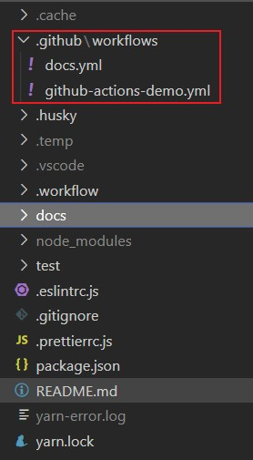
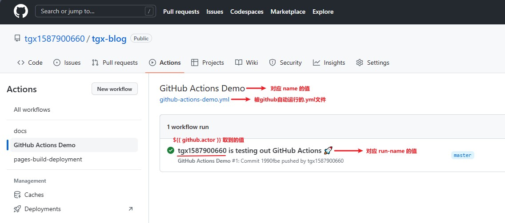
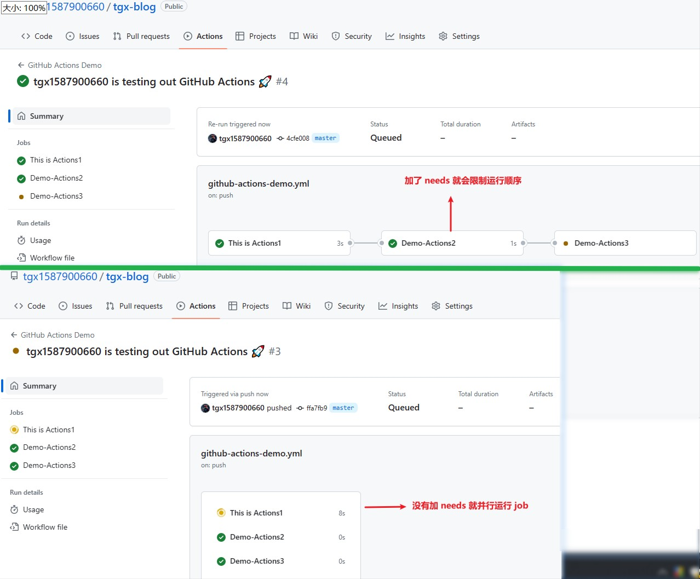

# 利用 Github Actions 自动部署博客

::: tip 读完这篇文章，你将能够：

- 1. 初步认识 Github Actions 是什么东西
- 2. 知道 Github Actions 运行的大概流程
- 3. 可以免费自动化部署 自己的静态站点

:::

- 我用 Vuepress 做了个静态网页博客，源码放在 github 仓库中。我的目的是想要：每次写完代码后，只要把代码 push 上去，就能自动更新博客。并且无需购买任何服务器，就能让所有人访问。

## 1. 创建 `workflows` 文件夹

在根目录下创建 `.github/workflows` 文件夹。这个文件夹中存放一些 `workflow` 文件。
`workflow` 文件采用 YAML 格式，文件名可以任意取，但是后缀名统一为 `.yml`，比如 `foo.yml`。一个库可以有多个 workflow 文件。GitHub 只要发现
`.github/workflows` 目录里面有 `.yml` 文件，就会自动运行该文件。



## 2. 创建并书写 `.yml` 内容

在 `.github/workflows` 文件夹中创建一个 `github-actions-demo.yml` 文件。并写入以下代码：
::: details 点击查看 github-actions-demo.yml 内容

```yml
# workflow 的名字，如果省略该字段，默认为当前 workflow 的文件名
name: GitHub Actions Demo

# workflow run 的名字，如果省略该字段，就取 commit 信息
run-name: ${{ github.actor }} is testing out GitHub Actions 🚀

# 触发事件, 这里是指 git push 时触发该 workflow, 事件有很多, push 只是其中之一,更多需要查文档
# on: [push]
# 指定触发事件时，也可以限定分支或标签。以下代码指: 只有在 master 分支 push 时才触发 workflow
on:
  push:
    branches: [master]

# jobs字段是主体，表示要执行的一项或多项任务。这里有3步。其中 name 是任务说明，没填就取 job 名
jobs:
  # 该 job 的名字
  Demo-Actions1:
    # 指定 job 名会覆盖 Demo-Actions1
    name: This is Actions1
    # 指定运行的环境
    runs-on: ubuntu-latest
    steps:
      - run: echo "这是第一步:Demo-Actions1"
      - run: echo "🎉 The job was automatically triggered by a ${{ github.event_name }} event."
      - run: echo "🐧 This job is now running on a ${{ runner.os }} server hosted by GitHub!"
      - run: echo "🔎 The name of your branch is ${{ github.ref }} and your repository is ${{ github.repository }}."
      - name: Check out repository code
        uses: actions/checkout@v3
      - run: echo "💡 The ${{ github.repository }} repository has been cloned to the runner."
      - run: echo "🖥️ The workflow is now ready to test your code on the runner."
      - name: List files in the repository
        run: |
          ls ${{ github.workspace }}
      - run: echo "🍏 This job's status is ${{ job.status }}."
  Demo-Actions2:
    runs-on: ubuntu-latest
    # 表示依赖，必须要在 Demo-Actions1 执行完之后，在执行该 job
    needs: Demo-Actions1
    steps:
      - run: echo "这是第二步:Demo-Actions2"
  Demo-Actions3:
    runs-on: ubuntu-latest
    # 表示依赖，必须要在 Demo-Actions1, Demo-Actions2 执行完之后，在执行该 job
    needs: [Demo-Actions1, Demo-Actions2]
    steps:
      - run: echo "这是第三步:Demo-Actions3"
      - name: 打印我的问候
        # 指定环境变量
        env:
          MY_CONST: Hi! My name is
          FIRST_NAME: Tele
          LAST_NAME: ctron
        run: |
          echo "$MY_CONST $FIRST_NAME$LAST_NAME."
```

:::

> 补充说明

- jobs 中的 runs-on 字段指定 虚拟机环境为 ubuntu-latest, 是必填字段
- jobs 中的 needs 字段指定 运行顺序，选填。如果不写，就并行运行任务
- jobs 中 steps 字段指定每个 job 的运行步骤，可以包含一个或多个步骤。每个步骤都可以指定某些字段
  - name: 步骤名称。如果没有指定 name 就直接取 run 的内容
  - run: 该步骤运行的命令
  - env: 该步骤所需的环境变量
- `${{ github.event_name }}` 取到的值是 `push`，也就是 on 指定的事件
- `${{ runner.os }}` 取到的值是 `Linux`
- `${{ github.ref }}` 取到的值是 `refs/heads/master`
- `${{ github.repository }}` 取到的值是 `tgx1587900660/tgx-blog`，也就是仓库名
- `${{ github.workspace }}` 取到的值是 `/home/runner/work/tgx-blog/tgx-blog`
- `${{ job.status }}` 取到的值是 `success`，指该 job 的状态

> 字段的说明图



> needs 字段效果图



- 到此为止，Github Actions 运行的大概流程，就学习完成了。接下来，要完成 Vuepress 的部署实战。

## 3. 实现 Vuepress 自动部署

::: tip

在 `github-actions-demo.yml` 平级目录新建一个 `docs.yml` 文件（可任起，只要是 .yml 结尾就行），并写入以下内容即可。每次 push 代码之后，以下内容就会被重跑。

:::

- 👇 这是 docs.yml 的 1.0.0 版本，实现了自动更新博客功能（随着 docs.yml 的更新，咱会了解更多的 workflow 知识）

::: details 点击查看 docs.yml 完整代码

```yml
# 以下是实现自动化部署 Vuepress 博客的完整内容
name: Deploy Docs
run-name: ${{ github.actor }} is deploying docs to github pages 🚀

on:
  push:
    branches: [master]

jobs:
  My-Job1:
    name: Build And Deploy Docs
    runs-on: ubuntu-latest
    steps:
      # 获取 git 日志，用于博客底部更新信息
      - name: get git info
        uses: actions/checkout@v3
        with:
          fetch-depth: 0
      # 设置 node 的版本
      - name: set Node version
        uses: actions/setup-node@v3
        with:
          node-version: '16'
      # 缓存 node_modules
      - name: Cache Dependencies
        uses: actions/cache@v3
        id: yarn-cache
        with:
          path: |
            **/node_modules
          key: ${{ runner.os }}-yarn-${{ hashFiles('**/yarn.lock') }}
          restore-keys: |
            ${{ runner.os }}-yarn-
      # 如果缓存没有命中，安装依赖
      - name: Install Dependencies
        if: steps.yarn-cache.outputs.cache-hit != 'true'
        run: yarn --frozen-lockfile
      # 打包生成 静态网页
      - name: Build VuePress site
        run: yarn build
      # 部署上线
      - name: Deploy to gitHub pages
        uses: crazy-max/ghaction-github-pages@v3
        with:
          # 部署到 gh-pages 分支
          target_branch: gh-pages
          # 部署目录为 VuePress 的默认输出目录
          build_dir: docs/.vuepress/dist
        env:
          # @see https://docs.github.com/cn/actions/reference/authentication-in-a-workflow#about-the-github_token-secret
          GITHUB_TOKEN: ${{ secrets.GITHUB_TOKEN }}
```

:::

- 👇 这是 docs.yml 的 1.0.1 版本，新增了 strategy 变量及其获取方式、steps 步骤通过 id 来取值方式

::: details 点击查看 docs.yml 完整代码

```yml{12-15,22-26,39}
name: Deploy Docs
run-name: ${{ github.actor }} is deploying docs to github pages 🚀

on:
  push:
    branches: [master]

jobs:
  My-Job1:
    name: Build And Deploy Docs
    runs-on: ubuntu-latest
    strategy:
      matrix:
        # See supported Node.js release schedule at https://nodejs.org/en/about/releases/
        node-version: [14.x, 16.x]
    steps:
      # 获取 git 日志，用于博客底部更新信息
      - name: get git info
        uses: actions/checkout@v3
        with:
          fetch-depth: 0
      # 设置 node 的版本
      - name: Use Node.js ${{ matrix.node-version }}
        uses: actions/setup-node@v3
        with:
          node-version: ${{ matrix.node-version }}
      # 缓存 node_modules
      - name: Cache Dependencies
        uses: actions/cache@v3
        id: yarn-cache
        with:
          path: |
            **/node_modules
          key: ${{ runner.os }}-yarn-${{ hashFiles('**/yarn.lock') }}
          restore-keys: |
            ${{ runner.os }}-yarn-
      # 如果缓存没有命中，安装依赖， cache-hit 是固定值
      - name: Install Dependencies
        if: ${{ steps.yarn-cache.outputs.cache-hit != 'true' }}
        run: yarn --frozen-lockfile
      # 打包生成 静态网页
      - name: Build VuePress site
        run: yarn build
      # 部署上线
      - name: Deploy to gitHub pages
        uses: crazy-max/ghaction-github-pages@v3
        with:
          # 部署到 gh-pages 分支
          target_branch: gh-pages
          # 部署目录为 VuePress 的默认输出目录
          build_dir: docs/.vuepress/dist
        env:
          # @see https://docs.github.com/cn/actions/reference/authentication-in-a-workflow#about-the-github_token-secret
          GITHUB_TOKEN: ${{ secrets.GITHUB_TOKEN }}

```

:::
