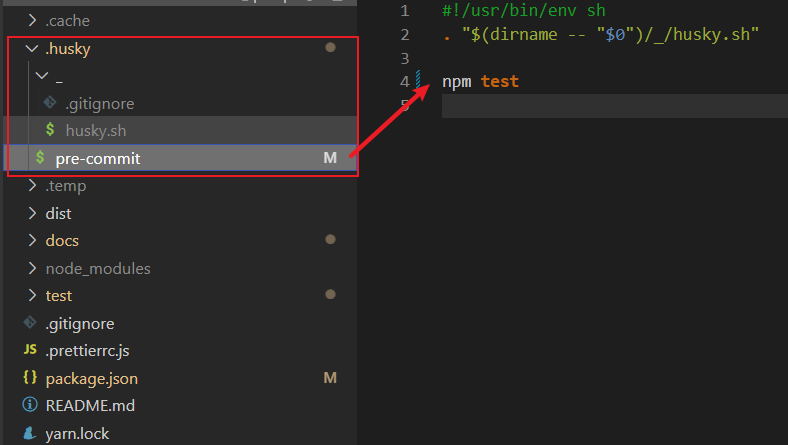
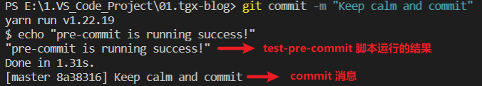

# 用 husky 阻住不合格的 code 提交

::: tip 问题说明

- 需求说明：git commit 提交时，利用 eslint 检测代码。如果不合格，终止这次 commit 提交。
- 实现方案：利用 husky + lint-staged + eslint 这 3 个插件包完成自动化操作。

:::

## 1. 学习目标

- 读完这篇文章，你将知道：
  1. husky 有什么作用？
  2. lint-staged 有什么作用？
  3. eslint 有什么作用？
  4. 三者的触发顺序是怎么样的？
  5. 具体怎么样在项目中一步步实现？

## 2. 这三个插件包的作用

- husky: 用来注册 git 钩子，确保你运行 git 命令时，会 **自动处理一些事情**。例如：
  1. 在运行 git commit 前我要在终端打印一条消息 "pre-commit is running success!"
  2. 在运行 git commit 前我要到 暂存区找到所有文件进行格式校验
  3. 在运行 git commit 前我要检测 你的 commit 消息是否合格
- lint-staged: 主要用来找到那些被 git add 到暂存区的文件
- eslint: 主要用来扫描文件，检测代码格式并报错

## 3. 执行顺序

::: tip 问题说明

- 顺序：**husky --> lint-staged --> eslint**
- 说明：先利**用 husky** 在你运行 git 命令时来**触发某个动作**。这个动作就是，利**用 lint-staged** 去**找到暂存区的文件**，然后利**用 eslint** **检测**暂存区文件中的**代码是否符合规范**

:::

## 4. 具体实现步骤

- 先来看下我的项目依赖以及环境

::: tip 项目说明

1. 这是一个用 vuepress 2.x 搭建的静态文档博客项目
2. 不需要一些诸如 webpack 之类的复杂 loader 配置，仅仅用来实现**阻止不规范代码提交**
3. node 版本是 v16.16.0
4. npm 版本是 v8.11.0
5. yarn 版本是 v1.22.19 （我使用的 yarn 作为包管理工具）

:::

::: details 点击查看 package.json

```json
{
  "name": "vuepress-blog",
  "version": "2.0.0",
  "description": "my-first-blog",
  "private": true,
  "scripts": {
    "dev": "vuepress dev docs",
    "build": "vuepress build docs"
  },
  "author": "telectron",
  "license": "ISC",
  "devDependencies": {
    "@vuepress/plugin-register-components": "^2.0.0-beta.49",
    "@vuepress/plugin-search": "^2.0.0-beta.49",
    "vuepress": "^2.0.0-beta.49"
  }
}
```

:::

### 4.1 安装使用 husky

- 安装 husky 依赖包，终端运行以下命令：

> 请注意依赖包的版本，可以自行指定对应版本

<CodeGroup>
<CodeGroupItem title="YARN" active>

```bash:no-line-numbers
yarn add husky -D
```

  </CodeGroupItem>

  <CodeGroupItem title="NPM">

```bash:no-line-numbers
npm install husky -D
```

  </CodeGroupItem>
</CodeGroup>

- 安装完毕后，在 package.json 中添加两个脚本 `prepare` 和 `test-pre-commit`。做完这些后，package.json 如下：

> `prepare` 是为了生成 .husky 目录，`test-pre-commit` 是为了测试钩子是否成功触发。
> 其中，第 10 行 echo 是输出语句，这句话，相当于 console.log("\\"pre-commit is running success!\\"")

::: details 点击查看 package.json

```json{9,10,17}
{
  "name": "vuepress-blog",
  "version": "2.0.0",
  "description": "my-first-blog",
  "private": true,
  "scripts": {
    "dev": "vuepress dev docs",
    "build": "vuepress build docs",
    "prepare": "husky install",
    "test-pre-commit": "echo \"pre-commit is running success!\""
  },
  "author": "telectron",
  "license": "ISC",
  "devDependencies": {
    "@vuepress/plugin-register-components": "^2.0.0-beta.49",
    "@vuepress/plugin-search": "^2.0.0-beta.49",
    "husky": "^8.0.1",
    "vuepress": "^2.0.0-beta.49"
  }
}
```

:::

- 终端运行以下命令，生成 .husky 文件夹：

> 以下 3 个命令之一被运行后，项目根目录(与 package.json 同级)会多出一个文件夹 .husky

<CodeGroup>
<CodeGroupItem title="YARN" active>

```bash:no-line-numbers
# 3个命令任选其一
yarn run prepare
```

  </CodeGroupItem>

  <CodeGroupItem title="NPM">

```bash:no-line-numbers
# 3个命令任选其一
npm run prepare
```

  </CodeGroupItem>
    <CodeGroupItem title="NPX">

```bash:no-line-numbers
# 3个命令任选其一
npx husky install
```

  </CodeGroupItem>
</CodeGroup>

- 创建钩子，终端运行以下命令：

```shell:no-line-numbers
# 该命令的意思是：在 .husky 目录下创建一个文件 pre-commit，里面包含一条命令 npm test
npx husky add .husky/pre-commit "npm test"
```

到此为止，.husky 文件夹和 pre-commit 文件内容就变成了下图：



- 手动定制 .husky/pre-commit 文件的内容，把 npm test 改成如下：

```bash
#!/usr/bin/env sh
. "$(dirname -- "$0")/_/husky.sh"

# 执行 package.json 中的 test-pre-commit 命令
yarn run test-pre-commit
```

- 测试 pre-commit 钩子是否成功运行，终端运行以下命令：

```bash
git add .husky/pre-commit
git commit -m "Keep calm and commit"
```

结果如下图：


到此为止，我们成功实现了在 commit 提交代码之前做某件事：**打印出"pre-commit is running success!"**
接下来，我们只需要把这件事换成：**找到暂存区的文件，做代码检测，若合格就提交，不合格就取消提交**

### 4.2 安装使用 eslint

- 第一步：安装 eslint 依赖包，终端运行以下命令：

> 请注意依赖包的版本，我这里是 "eslint": "^8.22.0"

<CodeGroup>
<CodeGroupItem title="YARN" active>

```bash:no-line-numbers
yarn add eslint -D
```

  </CodeGroupItem>

  <CodeGroupItem title="NPM">

```bash:no-line-numbers
npm install eslint -D
```

  </CodeGroupItem>
</CodeGroup>

- 第二步：建立 eslint 的配置文件。方式有很多，我选择 **在项目根目录下创建 .eslintrc.js 文件**，如下：

::: details 点击查看 .eslintrc.js 文件内容

```js
// .eslintrc.js 内容
module.exports = {
  root: true,
  env: {
    browser: true,
    node: true,
    es6: true
  },
  // 开启默认配置
  extends: 'eslint:recommended',
  // 自定义的规则
  rules: {
    semi: ['error', 'never'],
    quotes: ['error', 'single']
  }
}
```

:::

到此为止，eslint 的配置就算完成了。接下来就让 lint-staged 来使用它。

### 4.3 安装使用 lint-staged

- 第一步：安装 lint-staged 依赖包，终端运行以下命令：

> 请注意依赖包的版本，我这里是 "lint-staged": "^13.0.3"

<CodeGroup>
<CodeGroupItem title="YARN" active>

```bash:no-line-numbers
yarn add lint-staged -D
```

  </CodeGroupItem>

  <CodeGroupItem title="NPM">

```bash:no-line-numbers
npm install lint-staged -D
```

  </CodeGroupItem>
</CodeGroup>

- 第二步：在 package.json 中配置 lint-staged，如下：

> 我这个路径配置，只会校验那些 **test 文件夹下，并且已经被添加到暂存区的 .js 和 .ts 文件**

::: details 点击查看 package.json 文件内容

```json{22-24}
{
  "name": "vuepress-blog",
  "version": "2.0.0",
  "description": "我的第一个博客",
  "private": true,
  "scripts": {
    "dev": "vuepress dev docs",
    "build": "vuepress build docs",
    "prepare": "husky install",
    "test-pre-commit": "echo \"pre-commit is running success!\""
  },
  "author": "telectron",
  "license": "ISC",
  "devDependencies": {
    "@vuepress/plugin-register-components": "^2.0.0-beta.49",
    "@vuepress/plugin-search": "^2.0.0-beta.49",
    "eslint": "^8.22.0",
    "husky": "^8.0.1",
    "lint-staged": "^13.0.3",
    "vuepress": "^2.0.0-beta.49"
  },
  "lint-staged": {
    "test/**/*.{js,ts}": ["eslint"]
  }
}
```

:::


- 第三步：修改 .husky/pre-commit 的文件内容，如下：
```bash
#!/usr/bin/env sh
. "$(dirname -- "$0")/_/husky.sh"

# 执行 package.json 中的 test-pre-commit 命令
# yarn run test-pre-commit

# 执行 package.json 中的 lint-staged 节点命令
yarn run lint-staged

```

到此为止，我们就完成了所有配置，接下来测试即可。

- 第四步：测试