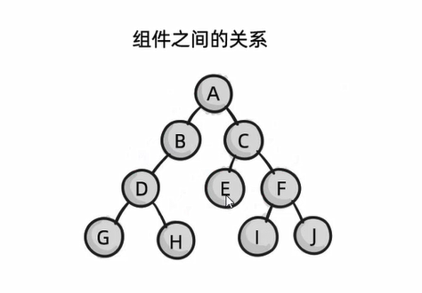

# Vue3 相关知识

## 1. 组件上的 v-model

::: tip 有什么作用
主要是为了 **实现组件内外的数据同步**
:::

- 首先在父组件中 v-bind: 前加上 v-model 指定 某个数据 需要被同步
- 然后在子组件用 props 接收 这个数据
- 接着在子组件的 emits 数组中声明 **'update:被同步的数据'** 这个自定义事件
- 最后在某个时机，用 this.$emit('update:被同步的数据', newValue) 发送事件，即可同时在父子组件中同步这个数据

::: details 点击查看使用案例

```html
<!-- 父组件中指定 title 会被双向同步 -->
<template>
  <my-component v-model:title="bookTitle"></my-component>
</template>

<script>
  // 子组件中进行接收 并用自定义事件 update:title 更新 title 的值
  app.component('my-component', {
    props: {
      title: String
    },
    emits: ['update:title'],
    template: `
    <input type="text"
        :value="title"
        @input="$emit('update:title', $event.target.value)">
  `
  })

  // 结果：不论是父组件的 bookTitle ，还是子组件的 $event.target.value
  // 都可以修改 title 的值，实现数据同步的目的
</script>
```

:::

## 2. 组件之间的通讯

### 1. 父传子

::: tip 提示

- 父组件：用 v-bind 传递
- 子组件：用 props 接收（这种方法接收的数据是响应式的，父组件数据变了，子组件也会变）

:::

### 2. 子传父

::: tip 提示

- 子组件：用 emits 自定义事件($emit) 发送
- 父组件：用 v-on 监听自定义事件 接收

:::

### 3. 父子组件双向同步

::: tip 提示

- 父组件：用 v-model:a="2" 绑定一个数据 a 给子组件
- 子组件：先用 props 接收 a , 再用 emits 自定义事件 ['update:a'] 更新数据 a 即可

:::

### 4. 兄弟组件共享数据

::: tip 提示

- 事先定义一个 eventBus.js 文件，并导出一个 事件中心 bus
- 组件 A：引入 bus 并用 this.$emit('事件名称', 参数) 发送一个自定义事件
- 组件 B：引入 bus 并用 this.$on('事件名称', (参数) => { 处理... }) 接收处理组件 A 发来的数据

:::

### 5. 后代组件共享数据

::: tip 传递方案： provide + inject

- 根组件：使用 provide 共享 **某些数据**
- 后代组件：使用 inject 接受 **这些数据**

:::

::: details 点击查看 【非响应式接收】 案例

```js
// 根节点中用 provide 定义 要共享 color myNumber 这两个数据
export default {
  ...
  data() {
    return { color: 'red' }
  },
  provide() {
    return {
      color: this.color,
      myNumber: 100
    }
  },
  methods: {},
  ...
}

----------------------------------------------------------------------

// 后代节点中用 inject 接受 color myNumber 这两个数据,
// 然后直接用 color myNumber 使用即可
export default {
  ...
  data() {
    return {}
  },
  inject: ['color', 'myNumber'],
  methods: {},
  ...
}
```

:::

::: details 点击查看 【响应式接收】 案例

```js
// 根节点中用 provide 定义 要共享 color myNumber 这两个数据
import { computed } from 'vue' // 借助 computed 方法实现响应式
export default {
  ...
  data() {
    return { color: 'red' }
  },
  provide() {
    return {
      color: computed(() => this.color), // 给 computed 方法传一个箭头函数
      myNumber: computed(() => 100)
    }
  },
  methods: {},
  ...
}

----------------------------------------------------------------------

// 后代节点中用 inject 接受 color myNumber 这两个数据,
// 然后用 color.value  myNumber.value 访问其值
export default {
  ...
  data() {
    return {}
  },
  inject: ['color', 'myNumber'],
  methods: {},
  ...
}
```

:::

::: warning 注意事项

- 这种方案要求：组件有 **嵌套关系**
- 如下图：
  - 如果 B 作为根节点要 **共享数据**，只有 D、G、H 可以接受，E、F 这些组件无法接收
  - 如果 A 作为根节点要 **共享数据**，则所有子组件可以接受

:::



### 6. Vuex 共享数据

::: tip 说明
使用一个 store 来集中共享数据
:::

### 7. 浏览器存储功能共享

::: tip 说明
使用浏览器的存储功能共享数据，如：cookie, sessionStorage, localStorage, IndexedDB 等
:::
