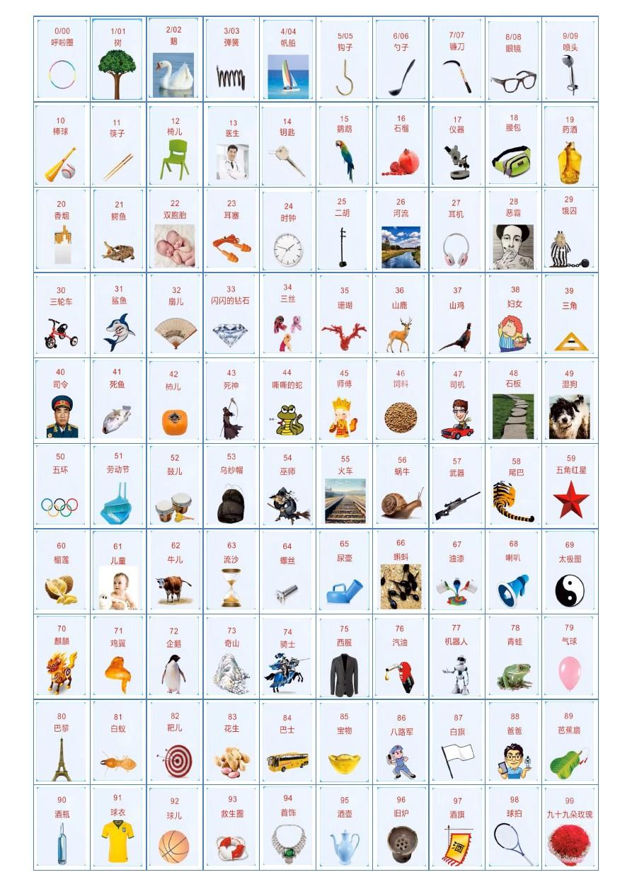

# 记忆大师（原理篇）

::: tip 说明

本文收录记忆方法，可以实现知识点 **永久记忆**

:::

## 三大记忆原理

- **魔力数字 7**：

  - 长内容要分段记忆，分组记忆
  - 要尽量建立联系，比如身体部位：头发，眼镜，耳朵等，要记得触摸，建立画面来想象记忆。

- **多维度记忆**：

  - 记东西要多维度，如：形状、颜色、气味等特点
  - 名词要用动作联系起来，连成一个画面或一句话
  - 要把抽象的东西具体化，把它变得有联系、有意义。

- **遗忘规律的应用**：

  - 遗忘是先快后慢的，所以复习要先密后疏
  - 5 个 1 原则，记完后要在 1 小时、1 天、1 星期、1 个月、1 季度内复习

## 三大记忆方法

- **配对联想法**：

  - 通过动作建立联系。如：维生素 A —> 尖尖的戳眼睛看不见 —> 夜盲症 —> 维生素 A 可防止夜盲症
  - 通过中间物建立联系。如：空调 —> 美的 —> 美国 —> 美国发明了空调
  - 合成一句话或一个画面。如：沙琪玛 —> 我的书包里装满了沙琪玛 —> 满族 —> 满足发明了沙琪玛

- **串联记忆法**：

  - 直接串联法，用动词来连成一个画面，要身临其境。
  - 抽字串联法，抽字 —> 组合 —> 谐音 —> 联想成画面记忆
  - 故事串联法，比如要记忆鲁迅的作品，可以串联成一个故事。

- **记忆宫殿法**：
  - 必须是自己熟悉的东西
  - 必须要有一定的顺序
  - 它们的大小和距离要适中
  - 它们必须要有特点

> 比如，利用身体部位来记忆十二星座

## 超级记忆准备——数字传化技巧

::: tip 说明

根据 **音(谐音)**、**形(形状)**、**义(意义)** 进行转化：

1. 把数字变形象，如：1314(一生一世), 520(我爱你)
2. 把数字变有趣，变熟悉，如：1 ——> 衣、腰、树、笔、第一名
3. 长数字，要分段，如：电话号码分成三段

:::

> 把数字 0-99 进行编码

|  0  |   呼啦圈   |  1  |      树      |  2  |      鹅      |  3  |     弹簧     |  4  |     帆船     |
| :-: | :--------: | :-: | :----------: | :-: | :----------: | :-: | :----------: | :-: | :----------: |
|  5  |    钩子    |  6  |     勺子     |  7  |     镰刀     |  8  |     眼镜     |  9  |     喷头     |
| 10  |    棒球    | 11  |     筷子     | 12  |     椅儿     | 13  | 医生(男医生) | 14  |     钥匙     |
| 15  |    鹦鹉    | 16  |     石榴     | 17  | 仪器(显微镜) | 18  |     腰包     | 19  |     药酒     |
| 20  |    香烟    | 21  |     鳄鱼     | 22  |    双胞胎    | 23  |     耳塞     | 24  |     时钟     |
| 25  |    二胡    | 26  |     河流     | 27  |     耳机     | 28  |     恶霸     | 29  |     恶囚     |
| 30  |   三轮车   | 31  |     鲨鱼     | 32  |     扇儿     | 33  |   闪闪钻石   | 34  |   三条丝巾   |
| 35  |    珊瑚    | 36  |     山鹿     | 37  |     山鸡     | 38  |     妇女     | 39  |    三角板    |
| 40  |    司令    | 41  |     死鱼     | 42  |     柿儿     | 43  |     死神     | 44  |      蛇      |
| 45  | 师傅(唐僧) | 46  |     饲料     | 47  |     司机     | 48  |     石板     | 49  |     湿狗     |
| 50  |  奥运五环  | 51  | 劳动节(扫帚) | 52  |     鼓儿     | 53  |    乌纱帽    | 54  |     巫师     |
| 55  |  呜呜火车  | 56  |     蜗牛     | 57  |   武器(枪)   | 58  |     尾巴     | 59  |   五角红星   |
| 60  |    榴莲    | 61  |     儿童     | 62  |     牛儿     | 63  |  流沙(沙漏)  | 64  |     螺丝     |
| 65  |    尿壶    | 66  |     蝌蚪     | 67  |     油漆     | 68  |     喇叭     | 69  |    太极图    |
| 70  |    麒麟    | 71  |     鸡翼     | 72  |     企鹅     | 73  |     奇山     | 74  |     骑士     |
| 75  |    西服    | 76  |     汽油     | 77  | 机器人(琪琪) | 78  |     青蛙     | 79  |     气球     |
| 80  |  巴黎铁塔  | 81  |     白蚁     | 82  |     靶儿     | 83  |     花生     | 84  |     巴士     |
| 85  |    宝物    | 86  |    八路军    | 87  |     白旗     | 88  |     爸爸     | 89  |    芭蕉扇    |
| 90  |    酒瓶    | 91  |     球衣     | 92  |  球儿(篮球)  | 93  |    救生圈    | 94  |  首饰(项链)  |
| 95  |    酒壶    | 96  |     旧炉     | 97  |   九面旗子   | 98  |     球拍     | 99  | 九十九朵玫瑰 |

